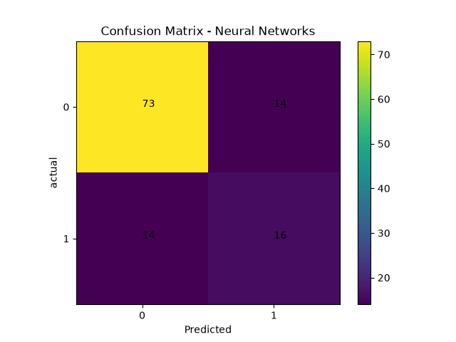

## Neural Networks Classification from scratch

This project implements Neural Networks classification from scratch without relying on machine learing libraries for the core algorithm. This project validated by comparing it's performance with sckit learn `MLPClassifier` on ILP Dataset.

## Features

* Neural Networks classification from scratch.
* intialize weights.
* ReLU function
* sigmoid function
* layer 1 prediction.
* convert hidden layer prediction into ReLU.
* ReLU output is output Layer input.
* backpropgation.
* find derivatives of hidden layer weights and output layer weights.
* update them.
* use those weights to predict test data.

## Dataset

`ILPD'(Indian Liver Patient Dataset)

source:
UCI Machine Learning Repository

This dataset contains `11 features and 583 samples`.

## Algorithm

Neural Networks is suprvised learning algorithm. That uses interconnected neurons arranged in layers to learn patterns in data and predict target outputs by adjusting weights and bias through backpropgation.

## predictions

### Hidden layer
z1 = w1 * x + b1
a1 = ReLU(z1)
ReLU(z1) = max(0,z)

### output layer
z2 = w2 * a1 + b2
a2 = sigmoid(z2)
sigmoid(a2) = 1 / (1 + e^-z2)


### Implementation

* Loaded the dataset.
* convert gender column into binary digits.
* filled the missed values in column.
* intialize hidden weights and outer weights.
* calculating hidden Layer .
* use convert hidden layer output into ReLU.
* Use the hidden layer ReLU output as output layer prediction input.
* convert output layer prediction into sigmoid probabality.
* find loss.
* backpropgation.
* find derivative of output layer weights and update weights.
* find derivative of hidden layer weights and update weights.
* use the weights to predict the test data.

## Results
### From scratch

```text
Accuracy: 0.7844827586206896
TP: 9
TN: 82
FP: 5
FN: 20
Precision Score: 0.6428571428571429
Recall Score: 0.3103448275862069
Confusion Matrix: 
[[82  5]
 [20  9]]
```

### scikit learn

```text
Accuracy: 0.7606837606837606
Precision Score: 0.5333333333333333
Recall Score: 0.5333333333333333
Confusion Matrix: [[73 14]
 [14 16]]
F1 score: 0.5333333333333333
```
### Visualizations

### confusion matrix



## Folder Structure

```text
Neural_Networks_classification/
│
├── plots/
│   ├── confusion_matrix.png
│
├── from_scratch.py
├── sklearn_model.py
├── visualization.py
└── README.md
```

### What I learned
* Learned Neural Networks implementation.
* Learned why using ReLU is useful.
* Learned the difference in classification and regression.
* Learned to use sigmoid or softmax for classification.
* Learned how neural networks use neurons to predict.
* Learned how backpropagation effects the outputs mathmetically.
* Learned how two layer predictions will work.
* Learned why randomly intialized weights essential.
* Learned to derive the mathmetics behind neural networks.
